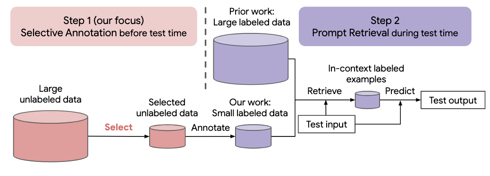

# Selective Annotation Makes Language Models Better Few-Shot Learners

Code for paper [Selective Annotation Makes Language Models Better Few-Shot Learners]()



Many recent approaches to natural language tasks are built on the remarkable
abilities of large language models. Large language models can perform in-context
learning, where they learn a new task from a few task demonstrations, without
any parameter updates. This work examines the implications of in-context learn-
ing for the creation of datasets for new natural language tasks. Departing from
recent in-context learning methods, we formulate an annotation-efficient, two-step
framework: selective annotation that chooses a pool of examples to annotate from
unlabeled data in advance, followed by prompt retrieval that retrieves task exam-
ples from the annotated pool at test time. Based on this framework, we propose an
unsupervised, graph-based selective annotation method, vote-k, to select diverse,
representative examples to annotate. Extensive experiments on 10 datasets (cov-
ering classification, commonsense reasoning, dialogue, and text/code generation)
demonstrate that our selective annotation method improves the task performance
by a large margin. On average, vote-k achieves a 12.9%/11.4% relative gain under
an annotation budget of 18/100, as compared to randomly selecting examples to
annotate. Compared to state-of-the-art supervised finetuning approaches, it yields
similar performance with 10-100× less annotation cost across 10 tasks. We further
analyze the effectiveness of our framework in various scenarios: language models
with varying sizes, alternative selective annotation methods, and cases where there
is a test data domain shift. We hope that our studies will serve as a basis for data
annotations as large language models are increasingly applied to new tasks

## Cloning this repo
Run the following command to clone this repo
```
git clone https://github.com/HKUNLP/icl-selective-annotation
```

## Dependencies
To establish the environment, run this code in the shell:
```
conda env create -f selective_annotation.yml
conda activate selective_annotation
cd transformers
pip install -e .
```
That will create the environment selective_annotation we used.

## Usage

### Environment setup

Activate the environment by running
```
conda activate selective_annotation
```

### End-to-end pipeline: selection, inference, evaluation
GPT-J as in-context learning model (1 GPU, 40GB memory)
```
python main.py --task_name dbpedia_14 --selective_annotation_method votek --model_cache_dir models --data_cache_dir datasets --output_dir outputs
```

## Citation
If you find our work helpful, please cite us
```
@article{Selective_Annotation,
      title={Selective Annotation: Makes Language Models Better Few-Shot Learners}, 
      author={Hongjin Su, Jungo Kasai, Chen Henry Wu, Weijia Shi, Tianlu Wang, Jiayi Xin, Rui Zhang, Mari Ostendorf, Luke Zettlemoyer, Noah A. Smith, Tao Yu},
      journal={},
      year={2022},
}
```


